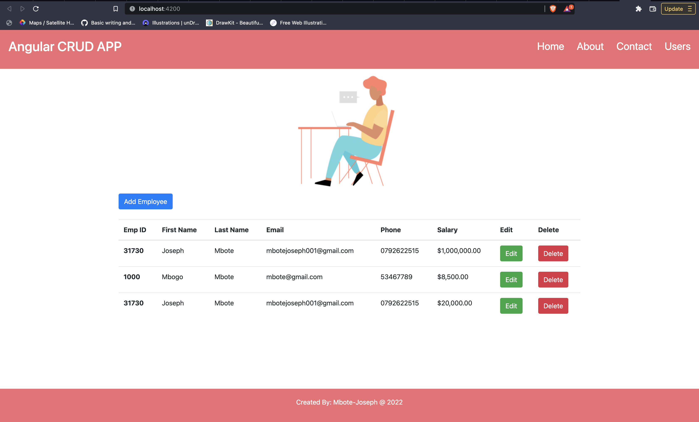
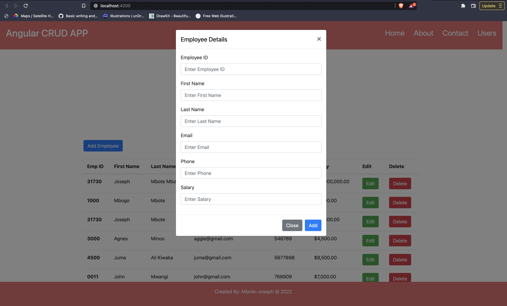
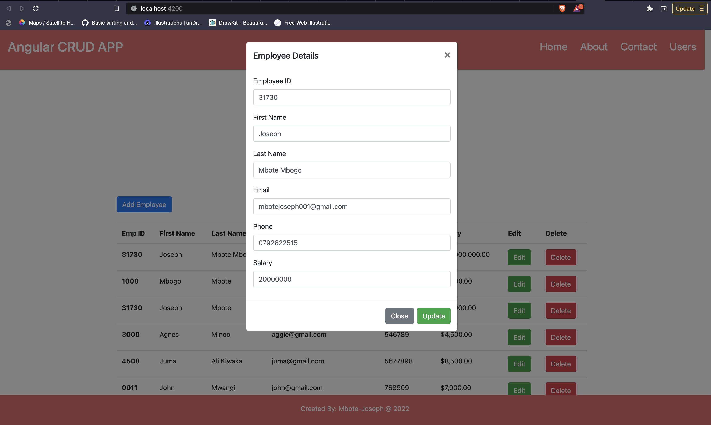

# CrudApp



## Read users data

```
getEmployeeDetails() {
    this.api.getEmployee().subscribe((res: any) => {
      console.log(res);
      this.employeeData = res;
    });
  }
```

### Add a new user



```
 postEmployeeDetails() {
    this.showUpdate = false;
    this.showAdd = true;
    this.employeeModelObject.empID = this.formValue.value.empID;
    this.employeeModelObject.firstName = this.formValue.value.firstName;
    this.employeeModelObject.lastName = this.formValue.value.lastName;
    this.employeeModelObject.email = this.formValue.value.email;
    this.employeeModelObject.phone = this.formValue.value.phone;
    this.employeeModelObject.salary = this.formValue.value.salary;

    console.log(this.employeeModelObject);

    this.api.postEmployee(this.employeeModelObject).subscribe(
      (res: any) => {
        console.log(res);
        alert('Employee Added successfully');
        this.getEmployeeDetails();
        let ref = document.getElementById('cancel');
        ref?.click();
        this.formValue.reset();
      },
      (err) => {
        alert('Something Went wrong');
      }
    );
  }
```

### Update a user



```
updateEmployeeDetails(employee: EmployeeModel) {
    this.showAdd = false;
    this.showUpdate = true;
    this.employeeModelObject.id = employee.id;
    this.formValue.controls['empID'].setValue(employee.empID);
    this.formValue.controls['firstName'].setValue(employee.firstName);
    this.formValue.controls['lastName'].setValue(employee.lastName);
    this.formValue.controls['email'].setValue(employee.email);
    this.formValue.controls['phone'].setValue(employee.phone);
    this.formValue.controls['salary'].setValue(employee.salary);
  }

  updateEmployee() {
    this.employeeModelObject.empID = this.formValue.value.empID;
    this.employeeModelObject.firstName = this.formValue.value.firstName;
    this.employeeModelObject.lastName = this.formValue.value.lastName;
    this.employeeModelObject.email = this.formValue.value.email;
    this.employeeModelObject.phone = this.formValue.value.phone;
    this.employeeModelObject.salary = this.formValue.value.salary;

    console.log(this.employeeModelObject);

    this.api
      .updateEmployee(this.employeeModelObject, this.employeeModelObject.id)
      .subscribe(
        (res: any) => {
          console.log(res);
          alert('Employee Updated successfully');
          this.getEmployeeDetails();
          let ref = document.getElementById('cancel');
          ref?.click();
          this.formValue.reset();
        },
        (err) => {
          alert('Something Went wrong');
        }
      );
  }

```

### Delete a user

```
  deleteEmployeeDetails(id: number) {
    this.api.deleteEmployee(id).subscribe((res: any) => {
      console.log(res);
      alert('Employee Deleted successfully');
      this.getEmployeeDetails();
    });
  }
```

### Service Description

```
import { Injectable } from '@angular/core';
import { HttpClient } from '@angular/common/http';
import { map } from 'rxjs/operators';

@Injectable({
  providedIn: 'root',
})
export class ApiService {
  url = 'http://localhost:3000/posts';
  constructor(private http: HttpClient) {}

  postEmployee(data: any) {
    return this.http.post<any>(`${this.url}`, data).pipe(
      map((res: any) => {
        return res;
      })
    );
  }

  getEmployee() {
    return this.http.get<any>(`${this.url}`).pipe(
      map((res: any) => {
        return res;
      })
    );
  }

  updateEmployee(data: any, id: number) {
    return this.http.put<any>(`${this.url}/` + id, data).pipe(
      map((res: any) => {
        return res;
      })
    );
  }

  deleteEmployee(id: number) {
    return this.http.delete<any>(`${this.url}/` + id).pipe(
      map((res: any) => {
        return res;
      })
    );
  }
}

```

This project was generated with [Angular CLI](https://github.com/angular/angular-cli) version 12.2.17.

## Development server

Run `ng serve` for a dev server. Navigate to `http://localhost:4200/`. The app will automatically reload if you change any of the source files.

## Code scaffolding

Run `ng generate component component-name` to generate a new component. You can also use `ng generate directive|pipe|service|class|guard|interface|enum|module`.

## Build

Run `ng build` to build the project. The build artifacts will be stored in the `dist/` directory.

## Running unit tests

Run `ng test` to execute the unit tests via [Karma](https://karma-runner.github.io).

## Running end-to-end tests

Run `ng e2e` to execute the end-to-end tests via a platform of your choice. To use this command, you need to first add a package that implements end-to-end testing capabilities.

## Further help

To get more help on the Angular CLI use `ng help` or go check out the [Angular CLI Overview and Command Reference](https://angular.io/cli) page.

## Employee Documentation

```
import { Component, OnInit } from '@angular/core';
import { FormBuilder, FormGroup } from '@angular/forms';
import { ApiService } from 'src/app/shared/api.service';
import { EmployeeModel } from '../../employee.model';

@Component({
  selector: 'app-employee-dashboard',
  templateUrl: './employee-dashboard.component.html',
  styleUrls: ['./employee-dashboard.component.css'],
})
export class EmployeeDashboardComponent implements OnInit {
  formValue!: FormGroup;

  employeeModelObject: EmployeeModel = new EmployeeModel();
  employeeData: EmployeeModel[] = [];
  showAdd: boolean = false;
  showUpdate: boolean = false;
  constructor(private formBuilder: FormBuilder, private api: ApiService) {}

  ngOnInit(): void {
    this.formValue = this.formBuilder.group({
      empID: [''],
      firstName: [''],
      lastName: [''],
      email: [''],
      phone: [''],
      salary: [''],
    });
    this.getEmployeeDetails();
  }

  postEmployeeDetails() {
    this.showUpdate = false;
    this.showAdd = true;
    this.employeeModelObject.empID = this.formValue.value.empID;
    this.employeeModelObject.firstName = this.formValue.value.firstName;
    this.employeeModelObject.lastName = this.formValue.value.lastName;
    this.employeeModelObject.email = this.formValue.value.email;
    this.employeeModelObject.phone = this.formValue.value.phone;
    this.employeeModelObject.salary = this.formValue.value.salary;

    console.log(this.employeeModelObject);

    this.api.postEmployee(this.employeeModelObject).subscribe(
      (res: any) => {
        console.log(res);
        alert('Employee Added successfully');
        this.getEmployeeDetails();
        let ref = document.getElementById('cancel');
        ref?.click();
        this.formValue.reset();
      },
      (err) => {
        alert('Something Went wrong');
      }
    );
  }

  getEmployeeDetails() {
    this.api.getEmployee().subscribe((res: any) => {
      console.log(res);
      this.employeeData = res;
    });
  }

  updateEmployeeDetails(employee: EmployeeModel) {
    this.showAdd = false;
    this.showUpdate = true;
    this.employeeModelObject.id = employee.id;
    this.formValue.controls['empID'].setValue(employee.empID);
    this.formValue.controls['firstName'].setValue(employee.firstName);
    this.formValue.controls['lastName'].setValue(employee.lastName);
    this.formValue.controls['email'].setValue(employee.email);
    this.formValue.controls['phone'].setValue(employee.phone);
    this.formValue.controls['salary'].setValue(employee.salary);
  }

  updateEmployee() {
    this.employeeModelObject.empID = this.formValue.value.empID;
    this.employeeModelObject.firstName = this.formValue.value.firstName;
    this.employeeModelObject.lastName = this.formValue.value.lastName;
    this.employeeModelObject.email = this.formValue.value.email;
    this.employeeModelObject.phone = this.formValue.value.phone;
    this.employeeModelObject.salary = this.formValue.value.salary;

    console.log(this.employeeModelObject);

    this.api
      .updateEmployee(this.employeeModelObject, this.employeeModelObject.id)
      .subscribe(
        (res: any) => {
          console.log(res);
          alert('Employee Updated successfully');
          this.getEmployeeDetails();
          let ref = document.getElementById('cancel');
          ref?.click();
          this.formValue.reset();
        },
        (err) => {
          alert('Something Went wrong');
        }
      );
  }

  deleteEmployeeDetails(id: number) {
    this.api.deleteEmployee(id).subscribe((res: any) => {
      console.log(res);
      alert('Employee Deleted successfully');
      this.getEmployeeDetails();
    });
  }
}

```

## Interface

```
export class EmployeeModel {
  id: number = 0;
  empID: string = '';
  firstName: string = '';
  lastName: string = '';
  email: string = '';
  phone: string = '';
  salary: string = '';
}

```
